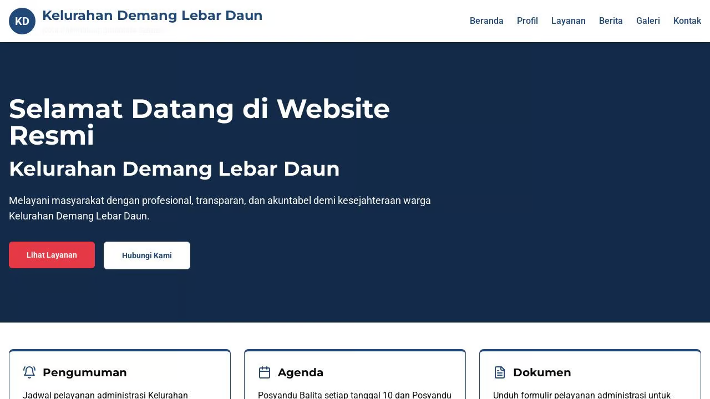

# Kelurahan Demang Lebar Daun Website

Official website for Kelurahan Demang Lebar Daun, Palembang, Indonesia. This website serves as an information portal for the local community with sections for profile information, services, news, gallery, and contact details.



## Overview

This project is a full-stack web application built with:

- **Frontend**: React.js with Typescript, Vite, Tailwind CSS, and Shadcn UI components
- **Backend**: Express.js with in-memory storage
- **Data Validation**: Zod and React Hook Form
- **API Communication**: TanStack Query

## Features

- **Profile Section**: Information about Kelurahan Demang Lebar Daun
- **Organizational Structure**: Displays the structure of the local government
- **Services Section**: Details about public services offered by the kelurahan
- **News Section**: Recent news and announcements
- **Gallery**: Photo gallery of recent activities
- **Contact Form**: Form for citizens to contact the kelurahan administration

## Project Structure

The project follows a modular architecture:

```
├── client/              # Frontend React application
│   ├── src/             
│   │   ├── assets/      # Static assets, icons, images
│   │   ├── components/  # React components
│   │   ├── hooks/       # Custom React hooks
│   │   ├── lib/         # Utility functions
│   │   ├── pages/       # Page components
│   │   ├── App.tsx      # Main App component
│   ├── index.html       # HTML template
├── server/              # Backend Express application
│   ├── index.ts         # Server entry point
│   ├── routes.ts        # API routes
│   ├── storage.ts       # In-memory storage implementation
├── shared/              # Shared code between client and server
│   ├── schema.ts        # Data models and schemas
```

## Getting Started

### Prerequisites

- Node.js 20 or later

### Installation

1. Clone the repository
2. Install dependencies:
   ```
   npm install
   ```

### Development

Run the development server:

```
npm run dev
```

This will start both the frontend (Vite) and backend (Express) servers.

## Future Enhancements

Planned features for future development:

- Citizen login portal
- Document download system
- Interactive event calendar
- Searchable news archive
- Integration with local government systems

## Language

The website is primarily in Indonesian to serve the local community of Palembang, Indonesia.

## License

© Kelurahan Demang Lebar Daun. All rights reserved.

habizinnia@gmail.com